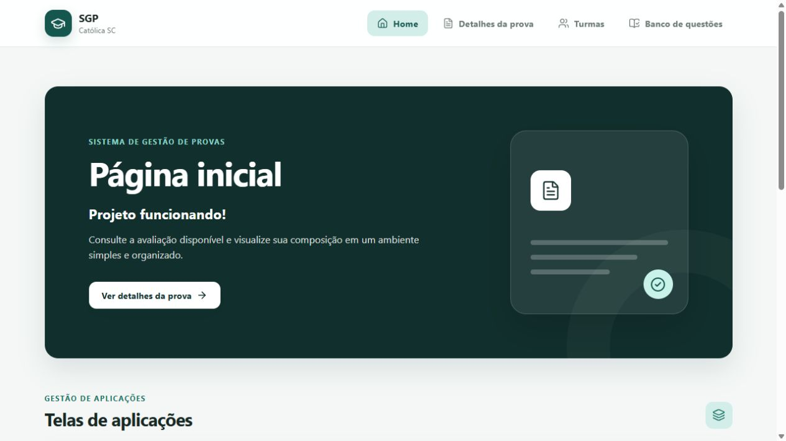
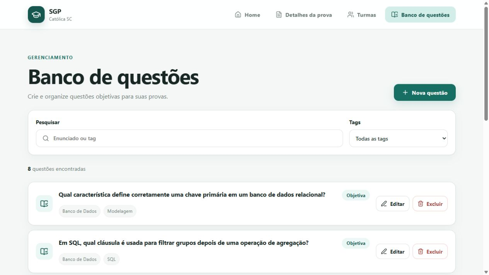
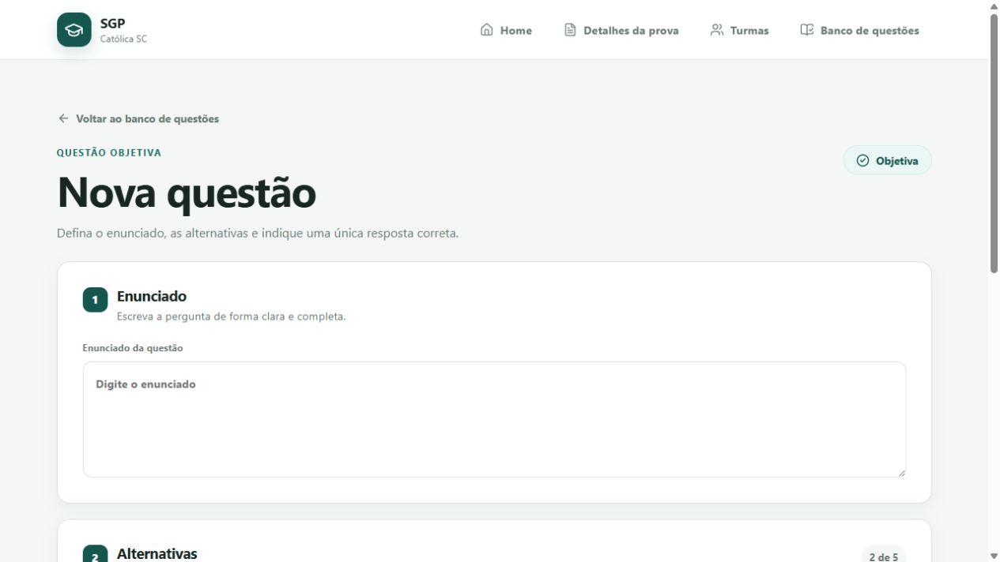
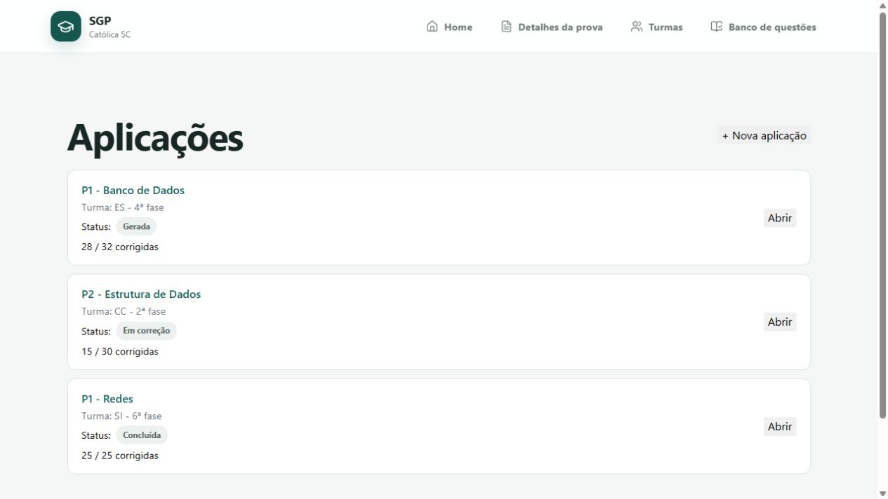

<div align="center">

# SGP Católica

### Sistema de Gestão de Provas

Plataforma acadêmica para criação, aplicação e correção de provas, voltada a professores e estudantes da Católica SC.

🔗 **Sistema hospedado:** ainda não publicado nesta entrega<br>
💻 **Código-fonte:** [github.com/VitorRinkawetsky/Correcao-Provas](https://github.com/VitorRinkawetsky/Correcao-Provas)


</div>

---

## 👥 Equipe

| Integrante | Atuação nesta entrega |
|---|---|
| Vitor Rinkawetsky | Configuração do projeto, integração das telas e revisão do front-end |
| Weliton Rodrigues | Fluxos de provas e tela de detalhes da avaliação |
| Laura Donath | Fluxos de aplicações, versões e atalhos da página inicial |
| Ana Clara Tomaselli Borchardt | Banco e formulário de questões objetivas |
| Gustavo Gorges Koch | Fluxos de turmas e estudantes |

---

## 📑 Sumário

- [1. Visão Geral](#1-visão-geral)
- [2. Requisitos](#2-requisitos)
  - [2.1 Requisitos Funcionais](#21-requisitos-funcionais)
  - [2.2 Requisitos Não Funcionais](#22-requisitos-não-funcionais)
- [4. Telas do Sistema](#4-telas-do-sistema)
- [8. Stack Tecnológica](#8-stack-tecnológica)
- [9. Estrutura de Pastas](#9-estrutura-de-pastas)
- [10. Como Executar](#10-como-executar)
- [14. Equipe e Contribuições](#14-equipe-e-contribuições)

---

## 1. Visão Geral

O **SGP Católica** é um projeto acadêmico criado para apoiar o ciclo de avaliações da instituição. A proposta é reduzir o trabalho manual dos professores por meio de um ambiente único para organizar questões, montar provas, gerar aplicações e acompanhar correções.

Nesta entrega **N1**, o repositório apresenta um protótipo navegável em Vue.js, abastecido por dados simulados. Estão disponíveis os fluxos visuais de banco de questões objetivas, criação e edição de questões, detalhes de prova, turmas e aplicações. Integrações persistentes com banco de dados, autenticação e correção automatizada permanecem como evoluções posteriores.

### Objetivos

- Centralizar a organização de avaliações e questões.
- Permitir questões objetivas com duas a cinco alternativas e uma única resposta correta.
- Facilitar a localização de questões por texto e tags.
- Representar o fluxo de criação, geração e acompanhamento de aplicações.
- Oferecer uma interface simples, consistente e adaptável a diferentes tamanhos de tela.

### Público-alvo

- Professores responsáveis pela criação e aplicação de avaliações.
- Estudantes que futuramente consultarão provas, resultados e histórico.
- Equipe acadêmica responsável pelo acompanhamento do processo avaliativo.

---

## 2. Requisitos

Os requisitos abaixo representam a visão do produto. A coluna **Situação na N1** diferencia o que já possui fluxo visual do que está previsto para as próximas entregas.

### 2.1 Requisitos Funcionais

| Código | Requisito | Situação na N1 |
|---|---|---|
| RF01 | Permitir criar, editar, listar e excluir questões objetivas. | Protótipo funcional |
| RF02 | Permitir de duas a cinco alternativas por questão e exigir uma única alternativa correta. | Protótipo funcional |
| RF03 | Permitir associar tags às questões e pesquisar o banco por enunciado ou tag. | Protótipo funcional |
| RF04 | Exibir os dados e a composição de uma prova. | Protótipo funcional |
| RF05 | Permitir criar, listar e consultar aplicações associadas a uma prova e a uma turma. | Protótipo funcional |
| RF06 | Configurar versões da aplicação, embaralhamento de questões e alternativas e identificação do estudante. | Protótipo funcional |
| RF07 | Permitir cadastrar turmas e estudantes. | Interface em desenvolvimento |
| RF08 | Corrigir cartões-resposta por imagem e identificar a prova por QR Code. | Planejado |
| RF09 | Calcular notas e disponibilizar relatórios e estatísticas da avaliação. | Planejado |
| RF10 | Autenticar usuários e controlar acessos de professores e estudantes. | Planejado |

### 2.2 Requisitos Não Funcionais

| Código | Requisito |
|---|---|
| RNF01 | A interface deve ser responsiva e utilizável em navegadores modernos. |
| RNF02 | A navegação deve usar elementos semânticos, foco visível e suporte a teclado. |
| RNF03 | A experiência deve ser simples, consistente e apresentada em português do Brasil. |
| RNF04 | O front-end deve funcionar como uma aplicação de página única com Vue Router. |
| RNF05 | Configurações de ambiente e credenciais não devem ser versionadas no código-fonte. |
| RNF06 | A persistência futura deve utilizar banco relacional MySQL. |
| RNF07 | Senhas e demais dados sensíveis não devem ser armazenados em texto puro. |
| RNF08 | O projeto deve possuir comandos reproduzíveis para desenvolvimento, testes e build. |

---

## 4. Telas do Sistema

### 4.1 Página inicial

Apresenta os acessos rápidos para a avaliação disponível e para os fluxos de aplicações.



### 4.2 Banco de questões

Lista as questões objetivas e permite pesquisar por enunciado ou tag, filtrar por tag, editar, excluir e iniciar um novo cadastro.



### 4.3 Formulário de questão objetiva

Permite informar o enunciado, cadastrar de duas a cinco alternativas, marcar exatamente uma resposta correta e adicionar tags.



### 4.4 Aplicações

Exibe as aplicações cadastradas, suas turmas, estados e o progresso de correção.



---

## 8. Stack Tecnológica

| Camada | Tecnologia | Uso no projeto |
|---|---|---|
| Front-end | Vue.js 3 | Componentes e interface reativa |
| Rotas | Vue Router | Navegação da aplicação de página única |
| Build | Vite 8 | Ambiente de desenvolvimento e geração do bundle |
| Estilos | CSS | Layout responsivo, tokens visuais e componentes |
| Ícones | Lucide Vue Next | Iconografia da interface |
| Servidor | Node.js e Express 5 | Entrega do build de produção e fallback da SPA |
| Banco de dados | MySQL 2 | Dependência preparada para a persistência futura |
| Testes | Vitest | Testes automatizados do front-end |
| Versionamento | Git e GitHub | Histórico e colaboração do projeto |

---

## 9. Estrutura de Pastas

```text
Correcao-Provas/
├── docs/
│   └── telas/                  # Capturas utilizadas nesta documentação
├── src/
│   ├── client/
│   │   ├── data/               # Dados simulados e stores da N1
│   │   ├── layouts/            # Estrutura visual compartilhada
│   │   ├── router/             # Rotas do front-end
│   │   ├── styles/             # Estilos globais e tokens
│   │   ├── ui/                 # Componentes reutilizáveis
│   │   ├── views/              # Telas organizadas por fluxo
│   │   ├── App.vue
│   │   └── main.js
│   ├── config/                 # Configuração reservada ao banco de dados
│   ├── app.js                  # Aplicação Express
│   └── server.js               # Inicialização do servidor
├── .env.example                # Modelo das variáveis de ambiente
├── index.html                  # Entrada do Vite
├── package.json                # Dependências e scripts
├── README.md
└── vite.config.mjs             # Configuração do build e dos testes
```

---

## 10. Como Executar

### Pré-requisitos

- [Git](https://git-scm.com/)
- [Node.js](https://nodejs.org/) 20.19 ou superior, ou 22.12 ou superior
- npm
- MySQL apenas para as integrações futuras de persistência

### Ambiente de desenvolvimento

```bash
git clone https://github.com/VitorRinkawetsky/Correcao-Provas.git
cd Correcao-Provas
npm install
```

No Windows PowerShell, copie o modelo de variáveis de ambiente:

```powershell
Copy-Item .env.example .env
```

Em Linux ou macOS:

```bash
cp .env.example .env
```

Depois, inicie o Vite:

```bash
npm run dev
```

A aplicação ficará disponível, por padrão, em [http://localhost:5173](http://localhost:5173).

> A entrega N1 utiliza dados simulados no front-end. As variáveis de banco existentes no arquivo `.env.example` estão reservadas para a integração posterior.

### Testes

```bash
npm test
```

### Build e execução de produção

```bash
npm run build
npm start
```

O servidor Express usa a porta definida em `PORT` ou, na ausência dela, a porta `3000`.

---

## 14. Equipe e Contribuições

| Integrante | Principais contribuições na N1 |
|---|---|
| Vitor Rinkawetsky | Estrutura inicial, dados simulados, migração para Vue, integração e correções gerais |
| Weliton Rodrigues | Listagem, formulário e detalhes de provas |
| Laura Donath | Listagem, criação, detalhes, geração e versões de aplicações |
| Ana Clara Tomaselli Borchardt | Banco, pesquisa e formulário de questões objetivas |
| Gustavo Gorges Koch | Listagem, formulário e detalhes de turmas |

---

<div align="center">

Projeto acadêmico desenvolvido para o curso de Engenharia de Software da Católica SC.

</div>
